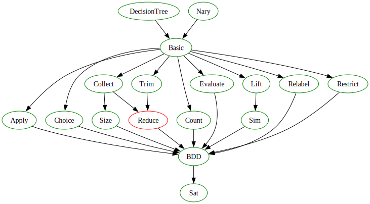

# Binary Decision Diagrams in Lean 4

This repository contains a Binary Decision Diagrams (BDD)
implementation and formalization in Lean 4.

## Status

The library is ready for use, but there is one file that is still not
`sorry`-free, as indicated by the red circle in the following
file-level dependencies graph of the library:



## Usage

To use this library in you project, add something like the following
to your `lakefile.toml` file:

```toml
[[require]]
name = "bdd"
git = "https://github.com/eshelyaron/lean4-bdd"
rev = "main"
```

Then import the library with `import Bdd` in your Lean file.

The main API lives in the `BDD` namespace.  It defines the `BDD` type,
along with functions such as `const`, `var`, `and`, `or`, `not`,
`restrict`, `bforall`, `bexists` and `relabel` which let you construct
BDDs.

It also provides lemmas that you can use to reason about the Boolean
functions that the BDDs that construct represent, for example
`BDD.and_denotation` is a lemma that characterizes the denotation of
(the Boolean function represented by) the BDD that you get from
`BDD.and`.

To check whether two BDD denote the same function, use
`BDD.instDecidableSemacticEquiv`.  To check if the denotation of a BDD
depends on a given input variable, use `BDD.instDecidableDependsOn`.
To find solutions, use `BDD.choice` or `BDD.find`.

## Example Application - SAT Solver

The file `SatSolver.lean` in the repository implements a BDD-based SAT
solver.  To build it, run `lake build SatSolver`.  Then execute it:

```sh
$ .lake/build/bin/SatSolver <number-of-variables> <input-file>
```

For example:

```sh
$ .lake/build/bin/SatSolver 40 /path/to/input/file/in/DIMACS/format
SAT
```
